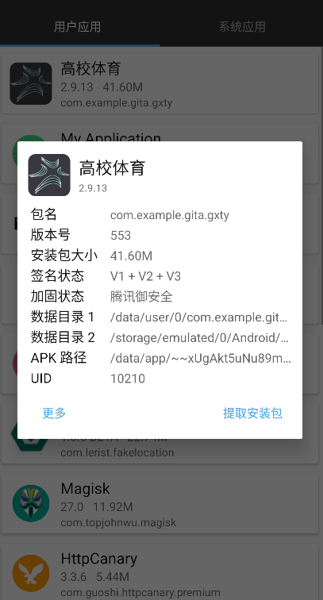
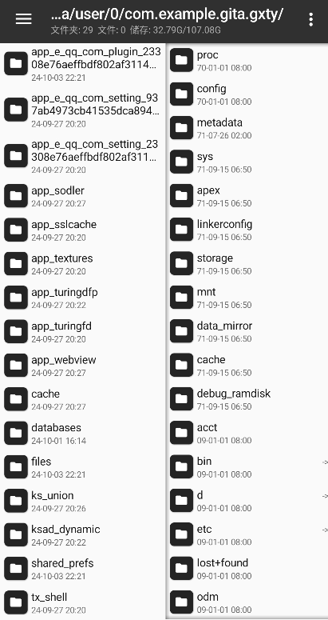
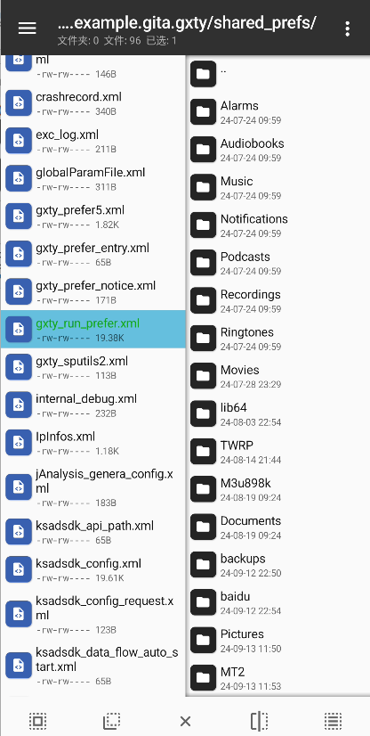
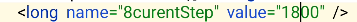

# Fuck SportCampus

一些高校体育使用的小tips。

<h2> Support: </h2>

- [x] 使用安卓10~12测试通过
- [x] ROOT/虚拟机/模拟器/VA
- [x] ABI arm64, x86, x86_64
- [x] ByPass步数限制
- [x] 任意位置场地签到

<h2>How 2 use:</h2>

<h3>ByPass步数限制</h3>

1. 跑步完成后点击暂停，不要立即上传记录。

2. 打开MT管理器

3. 进入高校体育的数据目录1

   

   

3. 进入shared_prefs文件夹

   

   4. 查看是否有如下选中文件，若有则打开

   

5. 打开后搜索**8currentStep**并修改

   

6. 打开高校体育并上传记录即可

<h3>Sign EveryWhere</h3>

1. ```shell
   pip install frida
   ```

2. 下载相应架构的frida-server(https://github.com/frida/frida.git)

3. 下载hook.js

4. 在手机端运行frida-server

   ```shell
   #这一步既可使用adb shell也可以使用安卓的terminal
   chmod 777 frida-server #记得把 frida-server push到/data下，否则可能permission denied
   ./frida-server
   ```

5. 打开高校体育

6. 在电脑运行

   若使用了虚拟环境记得要先进入环境(conda activate xxx)

   ```shell
   frida -U -n 高校体育 -l hook.js
   ```

7. 点击场地签到稍等片刻即可扫描到签到设备

8. 在签到过程中注意不要中断frida